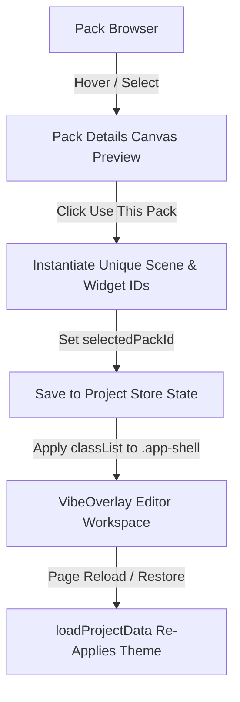

# Broadcast Pack & Template System

VibeOverlay Studio supports a fully data-driven **Broadcast Pack System** that enables users to browse, preview, and instantiate entire streaming overlays (themes, layouts, assets, fonts, transitions) without manual positioning.

---

## 1. Pack Architecture

A Broadcast Pack is represented by a serialized `StreamPack` definition which includes layout parameters, metadata, typographies, and a theme class:

```typescript
export interface PackScene {
  id: string;
  name: string;
  label: string;
  widgets: Omit<SceneWidget, 'id' | 'zIndex'>[];
}

export interface StreamPack {
  id: string;
  name: string;
  desc: string;
  category: string;
  accentColor: string;
  bgColors: [string, string];
  fontFamily: string;
  borderRadius: number;
  borderStyle: 'solid' | 'dashed' | 'dotted' | 'none';
  borderColor: string;
  glowColor?: string;
  glowBlur?: number;
  themeClass: string;
  decorations: string[];
  scenes: PackScene[];
}
```

---

## 2. On-Disk Folder & Code Structure

The pack architecture is decoupled to allow seamless integration of new visual setups:

```
StreamScenes/
├── src/
│   ├── data/
│   │   └── streamPacks.ts         # Serialized StreamPack array data-source
│   ├── pages/
│   │   ├── PackBrowserPage.tsx    # Onboarding pack browser directory view
│   │   └── PackDetailPage.tsx     # Pack scene/widget preview layout screen
│   └── store/
│       └── editorStore.ts         # Loader actions (createProjectFromPack, loadProjectData)
└── PACK_SYSTEM.md                 # System architecture documentation
```

---

## 3. Theme Custom Properties System

The layout system maps CSS custom properties (variables) on the top-level `.app-shell` element to control the layout and styling:

- **Primary Colors**: `--color-bg`, `--color-surface`
- **Accent Details**: `--color-accent`
- **Border Radii**: `--radius-md`, `--radius-lg`
- **Shadows & Glows**: Styled using variables `--color-border-hover` and custom filters on individual widgets.

When a pack is imported, its `themeClass` (e.g. `theme-cyber-synth`, `theme-glassmorphism`) is injected into the DOM, swapping all design system parameters instantly.

---

## 4. Import / Export Flow



1. **Previewing**: The `PackDetailPage` renders a lightweight `ScenePreviewCanvas` mapping widget definitions dynamically to percentage ratios, letting users audit pack scenes without altering current workspace state.
2. **Importing**: When `createProjectFromPack` runs, it generates fresh UUIDs for the scenes and widgets, applies the theme classes, and boots the workspace.
3. **Restoring**: On reload, `loadProjectData` retrieves the stored `selectedPackId` and re-applies the CSS class theme variables, avoiding styles going out of sync.
