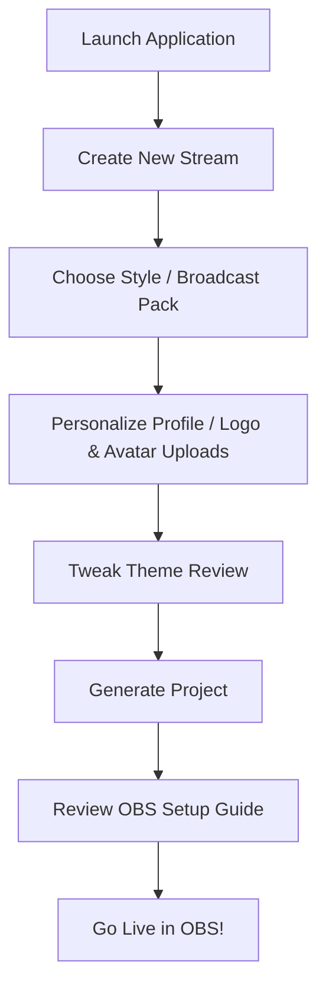

# Streamer Workflow & Onboarding Guide

This guide describes how streamers go from launching the application to going live with OBS using VibeOverlay Studio.

---

## 1. Primary User Journey

The primary workflow is designed to be completed in under 10 minutes without requiring external documentation:

---

## 2. Onboarding Wizard States

The onboarding wizard is a structured state machine with clear boundaries:

1. **`WELCOME`**: The greeting page, offering to "Create New Stream" or "Continue Recent Project" (if previous local project exists).
2. **`PACK_SELECTION`**: The pack browser where users can browse 8 premium templates, filter styles, and cycle scene previews.
3. **`PERSONALIZATION`**: Forms for Name, Channel, and Social Links.
   - **Upload first**: Built-in file upload slots for Logo and Avatar that convert selected local files to base64 immediately.
   - **Visual Camera Cards**: 5 custom-styled frame cards (Default, Rounded, Neon, Glass, Minimal) displaying layout shapes.
4. **`THEME_REVIEW`**: Live custom styles editor (Accent, Text, Background color pickers, Border Radius and Glass sliders).
5. **`BUILDING_PROJECT`**: Event-driven project compilation (places personalization data and theme overrides).
6. **`COMPLETE`**: Final checkmark screen with a single exit button "Launch Stream Editor".

---

## 3. Theme Customization & OBS Integration

- **Theme Overrides**: In addition to resetting configurations, the editor's Theme Manager panel provides quick access to **Duplicate**, **Save**, and **Export** (as local JSON file payload) theme assets.
- **OBS Browser Source**: A dedicated OBS Setup panel displaying local browser target links, standard 1920x1080 resolution, and 60 FPS output rendering options.
- **Readiness Panel**: A checklist checking if the style is applied, logo uploaded, socials linked, countdown timer set, and OBS verified.

---

## 4. Future Improvements (Tauri Desktop Milestones)
- Custom font directory registrations.
- Native OBS WebSocket integration for automated scene swapping.
- Multiple local project files history manager.
